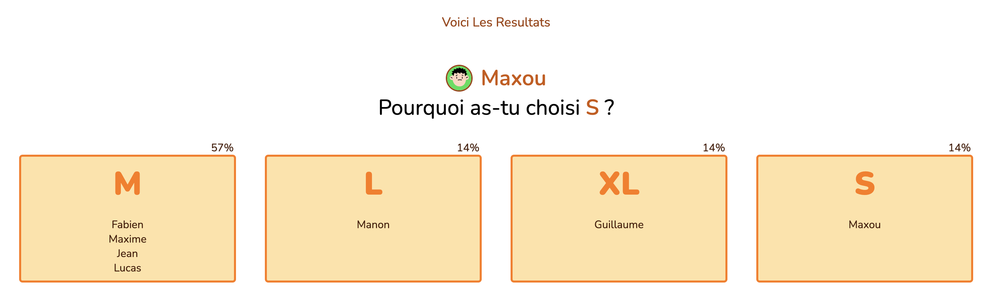

# Another Planning Poker

Welcome to **Another Planning Poker**! This site is designed to make your Planning Poker sessions more efficient, fun, and engaging. With our tool, you can get instant, clear results and benefit from detailed, high-quality analysis.

## Features

- **Session Creation**: Easily create new Planning Poker sessions for your team.
- **Join Sessions**: Join existing sessions with a unique code.
- **User Management**: Manage participants and track their votes in real-time.
- **Instant Results**: Get immediate results and visualize vote percentages.
- **Customization**: Customize the appearance of your session with personalized colors. (Easter Egg 👀)

## How It Works

1. **Create a Session**: Go to the creation page and enter your team name.
2. **Join a Session**: Use the provided code to join an existing session.
3. **Vote**: Each participant can vote to estimate the complexity of tasks.
4. **View Results**: Results are displayed instantly, with clear percentages and engaging visualizations.

## Why Use Another Planning Poker?

- **Simplicity**: An intuitive user interface that makes creating and managing Planning Poker sessions a breeze.
- **Speed**: Get instant results without any waiting.
- **Engagement**: Animations and visualizations that make the voting process more fun and engaging.
- **Accessibility**: Accessible from any device with an internet connection.
- **Free and Ad-Free**: 100% free with zero ads, created out of passion by enthusiasts.

## Try It Now!

Don't waste time with complicated and inefficient tools. Try **Another Planning Poker** for your next Planning Poker session and see the difference!

[Visit Another Planning Poker](https://anotherpp.vercel.app/)

## Screenshots

Here are some screenshots to give you a glimpse of what Another Planning Poker looks like:

### Create Session

*The interface for creating a new Planning Poker session.*

### Join Session

*The screen whene participants join an existing session using a unique code.*

### Voting

*The voting interface where participants can estimate the complexity of tasks.*

### Results

*The results page showing the voting outcomes with clear percentages and visualizations.*

### Room Manager

*The manager page for managing user stories to be voted on and viewing the results of the votes with clear percentages and visualizations.*


## Developing

To get started with the project, install dependencies with `npm install` (or `pnpm install` or `yarn`), start a development server:

```bash
npm run dev

# or start the server and open the app in a new browser tab
npm run dev -- --open
```

## Building

To create a production version of your app:

```bash
npm run build
```

You can preview the production build with `npm run preview`.

> To deploy your app, you may need to install an [adapter](https://svelte.dev/docs/kit/adapters) for your target environment.
